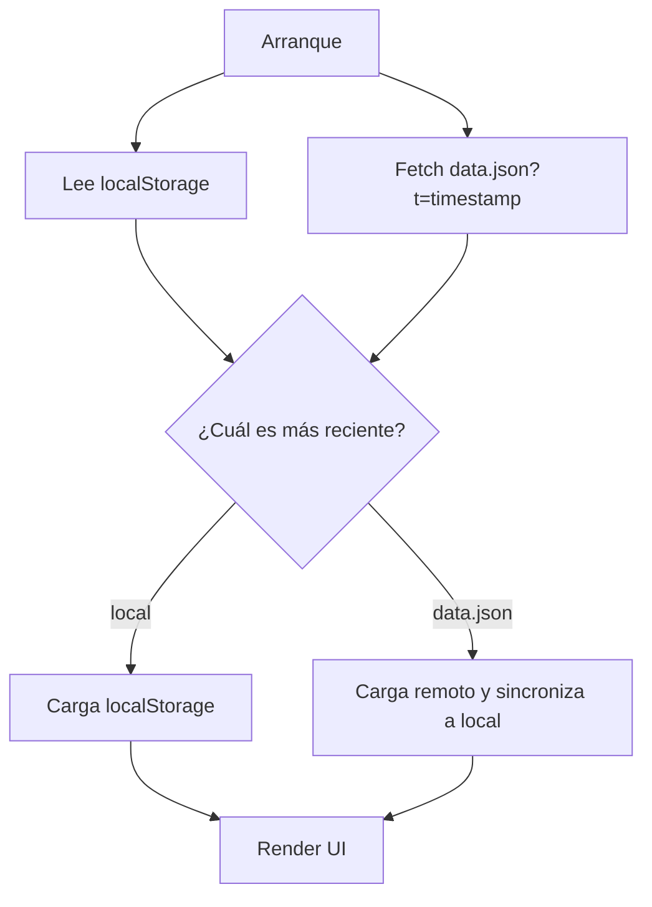

# SquadPlay 🎮
Organiza partidas con tus amigos en una sola página. Selecciona una combinación exacta de jugadores y la app te dirá a qué juegos podéis jugar hoy. Marca terminados, guarda histórico, y presume de dashboard con estadísticas. Funciona offline como PWA. Estilo Xbox. 100% HTML + CSS + JavaScript vanilla.

[](#)
[](#)
[](#)
[](LICENSE)

> Demo: https://TU-USUARIO.github.io/TU-REPO/  
> (reemplaza TU-USUARIO y TU-REPO tras publicar en GitHub Pages)

---

## ✨ Características

- Selección de jugadores en un grid táctil y rapidísimo.
- Filtro por combinación EXACTA de jugadores.
- CRUD completo de jugadores y juegos.
- Marcar juegos como terminados + histórico reciente.
- Dashboard con estadísticas:
  - Totales, plataformas, combos exactos, ranking por jugador, completados por mes.
- PWA: funciona offline + botón Instalar + iconos móviles.
- Modo claro/oscuro persistente (estilo Xbox).
- Datos compartidos por JSON (+ exportación) y locales vía localStorage.
- 1 solo archivo principal: `index.html` (sin dependencias).

---

## 📸 Capturas

> Guarda tus capturas en `docs/` y actualiza las rutas.

- Home (selección de jugadores): `docs/screenshot-home.png`  
- Añadir juego (modal): `docs/screenshot-add-game.png`  
- Dashboard: `docs/screenshot-dashboard.png`

---

## 🚀 Empezar en 30 segundos

1) Clona este repo o usa “Use this template”.  
2) Sirve localmente (necesario para PWA/Fetch):
   - VS Code: extensión “Live Server” → Go Live.
   - Python: `python -m http.server 8080`
3) Abre http://localhost:8080 y… ¡a jugar!

Publicar en GitHub Pages:
- Sube `index.html`, `manifest.webmanifest`, `sw.js`, carpeta `icons/` y opcional `data.json` a la rama `main`.
- Activa Pages en Settings → Pages → Source: `main` (root).
- Demo en: `https://TU-USUARIO.github.io/TU-REPO/`.

---

## 📦 Estructura

```
.
├─ index.html               # App completa (UI + lógica)
├─ data.json                # Datos "oficiales" para compartir (opcional)
├─ manifest.webmanifest     # PWA manifest
├─ sw.js                    # Service Worker (caché offline)
├─ icons/
│  ├─ icon-192.png
│  └─ icon-512.png
└─ docs/                    # Capturas, assets de README (opcional)
```

---

## 🧠 Cómo funcionan los datos

- La app compara en el arranque qué está más fresco: `localStorage` vs `data.json` del repo. Carga el más reciente.
- Puedes editar localmente (CRUD) y luego “Exportar JSON” para subir un nuevo `data.json` al repo.

Diagrama de sincronización:



Exportar:
- Botón “💾 Exportar JSON” → descarga `data.json` con todo (meta + players + games + stats).
- Súbelo al repo y listo. La próxima carga usará esa versión.

Notas:
- `localStorage` ≈ 5MB por navegador.
- No hay backend: `data.json` se actualiza manualmente con el botón de exportar.

---

## 🗃️ Esquema de `data.json`

```json
{
  "meta": {
    "version": 12,
    "lastUpdated": "2025-01-01T12:34:56.000Z",
    "appVersion": 1,
    "source": "data.json"
  },
  "players": [
    { "id": "p1", "name": "Alex", "color": "#34a853", "createdAt": "", "updatedAt": "" }
  ],
  "games": [
    {
      "id": "g1",
      "title": "Halo Infinite",
      "platform": "Xbox",
      "players": ["p1","p2"],
      "completed": false,
      "completedAt": null,
      "addedAt": "",
      "updatedAt": ""
    }
  ],
  "stats": { }
}
```

- `stats` se recalcula en la app y se incluye al exportar (para consulta rápida).

---

## 🎛️ Uso rápido

- Toca para seleccionar jugadores.
- Mantén pulsado o pulsa ⋮ en un jugador para editar/eliminar.
- El filtro de juegos es por combinación EXACTA de los jugadores seleccionados.
- Búsqueda, plataforma y estado (Activos/Terminados/Todos) afinan el listado.
- Atajo: pulsa `/` para enfocar el buscador.

---

## 📱 PWA (offline + instalar)

- Botón “⬇️ Instalar” aparecerá cuando el navegador lo permita.
- iOS: “Compartir → Añadir a pantalla de inicio”.
- Offline: la app se sirve desde la caché del Service Worker.
- Si cambias assets, sube `sw.js` con un nuevo nombre de caché:
  ```js
  const CACHE_NAME = 'squadplay-vX'; // incrementa X
  ```

---

## 🎨 Estilo y accesibilidad

- Paleta Xbox (verde 107C10, negros/blancos), dark/light mode.
- Diseño responsive optimizado para móvil.
- Contraste y estados de foco/selección visibles.
- Gestos táctiles: tap para seleccionar, long-press para editar.

---

## 🛠️ Desarrollo

- Solo HTML + CSS + JS. Sin build step.
- Depura fetch/caché en DevTools → Application → Service Workers.
- Hard refresh tras cambios grandes: Ctrl/Cmd + Shift + R.
- Si “desaparece” un botón que tenía listener, usa optional chaining:
  ```js
  document.querySelector('#btnX')?.addEventListener('click', fn);
  ```

---

## 🧭 Roadmap

- [x] CRUD de jugadores y juegos
- [x] Filtro por combinación exacta
- [x] Dashboard de estadísticas
- [x] PWA (offline + instalar)
- [x] Eliminar jugadores (con limpieza de juegos vacíos)
- [ ] Importar JSON desde archivo (UI)
- [ ] Tags y favoritos por juego
- [ ] Planificador de sesiones + export .ics
- [ ] Integración con Discord/WhatsApp (enlace)
- [ ] PWA: sincronización opcional en background
- [ ] Tests de UI e2e con Playwright

¿Ideas? ¡Abre un issue!

---

## 🤝 Contribuir

¡Todas las contribuciones son bienvenidas!

1. Haz fork y crea una rama:
   ```
   git checkout -b feat/descripcion
   ```
2. Cambios pequeños y bien enfocados. Commits claros:
   - `feat:`
   - `fix:`
   - `docs:`
   - `style:`
   - `refactor:`
3. Abre un Pull Request:
   - Describe el “qué” y el “por qué”.
   - Adjunta capturas si afecta a la UI.
   - Marca “bump” del `CACHE_NAME` si tocaste assets del PWA.

Issues útiles:
- bug: describe pasos para reproducir
- feature: explica el caso de uso
- design: ideas de UI/UX, mockups
- help wanted / good first issue: para onboarding

Código de conducta:
- Respeto, inclusividad y empatía. Divergencias = oportunidad de aprender.

---

## 🧩 Preguntas frecuentes

- “No me aparece el botón Instalar”
  - En escritorio puede salir en la barra de URL (icono “instalar”). En iOS se instala desde “Compartir”.
- “No veo mis cambios”
  - Haz hard refresh o incrementa `CACHE_NAME` en `sw.js`.
- “¿Dónde se guardan mis datos?”
  - Localmente en `localStorage`. Para compartirlos, exporta y sube `data.json`.
- “¿Puedo ocultar el botón de Reset demo?”
  - Sí. Asegúrate de que su listener use `?.addEventListener` para no romper el script.

---

## 🔐 Licencia

Este proyecto es open source bajo la licencia MIT.  
Copia, modifica y comparte con cariño. Consulta el archivo LICENSE.

---

## 🙌 Créditos

- Idea y feedback: la comunidad SquadPlay 💚  
- Emoji gamepad: tipografía del sistema.  
- Colores: amor por Xbox.

Si este proyecto te ayuda, dale una ⭐ en GitHub y compártelo con tu escuadrón.

¡Nos vemos en la próxima partida! 🟢🎮